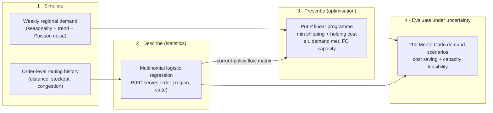
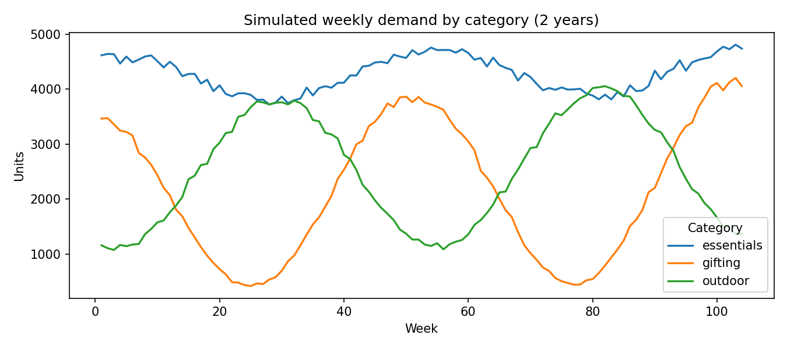
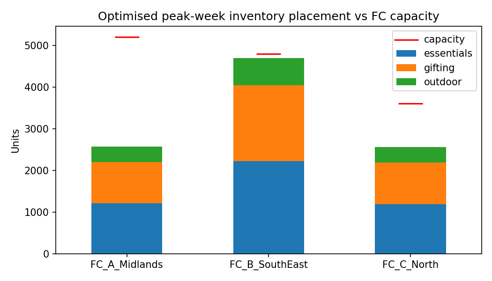

# Inventory Placement Optimiser


End-to-end supply-chain planning mini-project: a **multinomial logistic regression (MNL)**
describes how orders are routed across a fulfilment network today, and a **linear-programming
optimiser (PuLP)** prescribes where inventory *should* be placed for peak weeks — evaluated
under demand uncertainty with Monte Carlo simulation.

> Built while preparing for network-planning-optimisation data science roles, to practise the
> two model families this domain runs on: discrete-choice statistical models and mathematical
> optimisation.

---

## Pipeline



## The problem

A retailer serves **6 UK demand regions** from **3 fulfilment centres (FCs)** with limited
weekly capacity. Three product categories have different seasonal peaks (essentials are flat,
outdoor peaks in summer, gifting peaks in Q4).



Two questions a network-planning team asks:

1. **How does the network behave today?** Which FC actually serves each region's orders,
   given distance, stock availability and congestion? → *descriptive statistical model.*
2. **Where should we place inventory for peak weeks?** → *prescriptive optimisation model.*

## 1 · Describing current routing with multinomial logistic regression

Two years of simulated order-level routing outcomes (40k orders) are generated from a hidden
utility function over distance, stockout and congestion. An MNL is then fitted to recover the
behaviour — the classic discrete-choice model for "which of K alternatives is chosen".

| Metric (held-out 20%) | Value |
|---|---|
| Accuracy | **0.87** |
| Majority-class baseline | 0.49 |
| Log loss | 0.36 |

Averaging predicted probabilities over stockout/congestion states gives the **current-policy
flow matrix** P(FC | region):


The recovered flows are geographically sensible — London/South-East orders concentrate on the
South-East FC, northern regions on the North FC — which is exactly why the South-East FC is
the network's bottleneck in Q4.

## 2 · Prescribing placement with linear programming

Decision variables `x[region, category, fc] >= 0` (units placed at each FC to serve each
region-category demand), solved with PuLP/CBC:

- **Objective:** minimise `shipping (GBP/unit·distance) + holding (GBP/unit·week)` cost
- **Constraints:** every region-category demand fully met; each FC within weekly capacity



## 3 · Results under demand uncertainty

200 Monte Carlo scenarios perturb peak-week (Q4) demand with lognormal noise (σ = 0.15), and
each scenario is re-optimised and compared with the MNL-implied current policy:


| Peak-week result (200 scenarios) | Current policy | Optimised plan |
|---|---|---|
| Mean cost saving vs policy | — | **12.3%** (min 3.4%, max 20%+) |
| Scenarios breaching FC capacity | **51%** | **0%** |

Two takeaways a planning team would care about:

- The optimised plan is **cheaper in every scenario**, mainly by shifting South-West and
  overflow South-East volume to the under-utilised Midlands FC.
- More importantly, the current policy is **infeasible in half of peak scenarios** — the
  South-East FC breaches capacity — while the optimised plan respects capacity by design.
  Cost is not the only reason to plan placement centrally; feasibility is.

## Repository structure

```
├── src/
│   ├── simulate_demand.py      # demand + network definition
│   ├── fulfilment_choice.py    # MNL routing model (scikit-learn)
│   ├── optimise_placement.py   # PuLP LP + Monte Carlo evaluation
│   └── make_figures.py         # all README figures
├── data/                       # generated CSVs (demand, flows, placement, scenarios)
└── results/figures/
```

## How to run

```bash
pip install -r requirements.txt
# run from the repo root (scripts read/write data/ and results/):
PYTHONPATH=src python src/simulate_demand.py
PYTHONPATH=src python src/fulfilment_choice.py
PYTHONPATH=src python src/optimise_placement.py
PYTHONPATH=src python src/make_figures.py
```

Runs end-to-end in ~2 minutes on a laptop; everything is seeded for reproducibility.

## Limitations & next steps

- Data is **simulated**, so the MNL "recovers" behaviour that was generated from a known
  utility — real order data would need feature engineering and drift monitoring.
- The LP is deterministic per scenario; a natural extension is **two-stage stochastic
  programming** (place inventory before demand is revealed, recourse shipping after).
- Single-week planning; multi-period placement with transfer costs would capture
  pre-positioning ahead of Q4.
- Service-level constraints (e.g. 95% of demand within 1-day range) and multinomial choice
  of **delivery speed** on the customer side are further realistic extensions.
