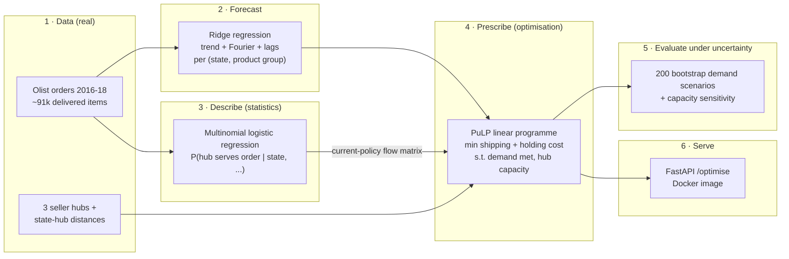
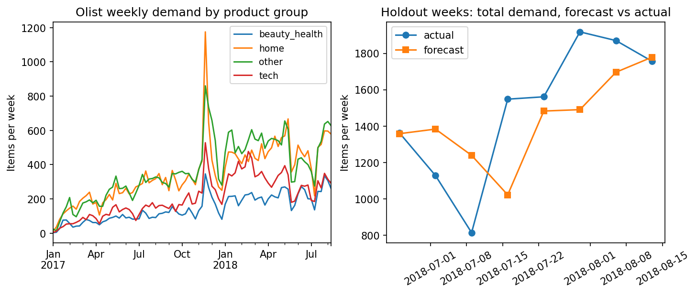
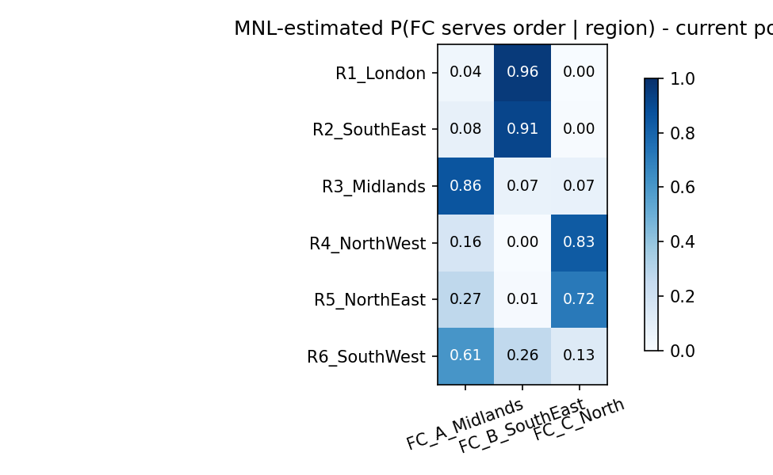
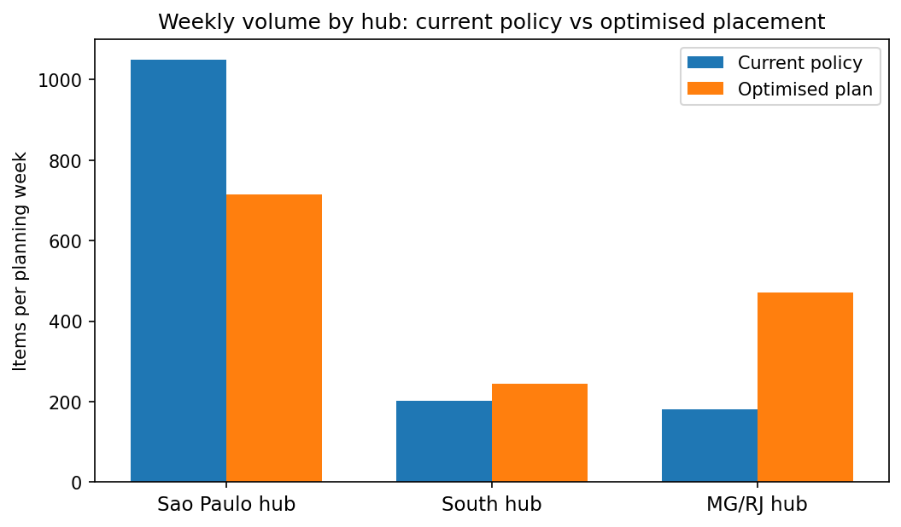
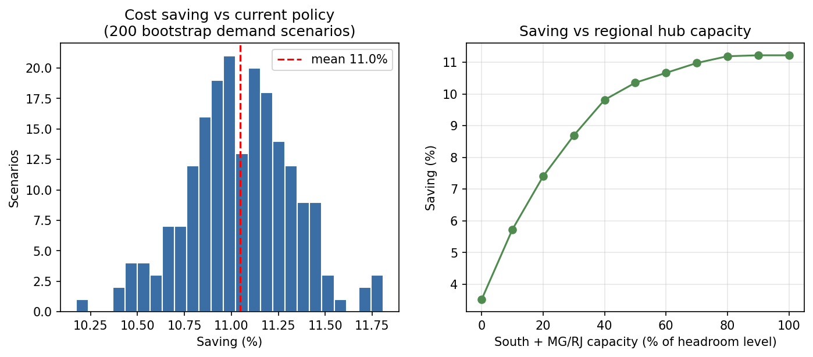

# Inventory Placement Optimiser


End-to-end supply-chain planning project on **real data** (Olist Brazilian e-commerce,
~91k delivered order items, 2016–2018). Three models do the planning.

1. a **ridge-regression forecaster** predicts weekly demand: order items per
   customer state × product group (32 series: 8 Brazilian states × 4 groups),
2. a **multinomial logistic regression (MNL)** describes how orders are routed across
   the fulfilment network today,
3. a **linear-programming optimiser (PuLP)** prescribes where inventory *should* be
   placed — evaluated under demand uncertainty with residual-bootstrap scenarios.

All of this is served as a **FastAPI service in Docker**.

## Goal

Show, on real order-level data, that a network-planning team can move from *describing*
current fulfilment behaviour to *prescribing* a better one — and that the improvement is
robust rather than a fitting artefact:

1. **Describe** — recover today's implicit routing policy with a discrete-choice model,
   and quantify how far it is from a geographically sensible one.
2. **Prescribe** — measure how much cost that policy leaves on the table, by solving for
   the placement that minimises shipping + holding cost under hub capacity.
3. **Stress-test** — confirm the saving survives demand-forecast error and different
   capacity assumptions, then expose the optimiser as a service a planning team could
   actually call with its own assumptions.

---

## Pipeline



## The problem

Olist is a marketplace whose sellers cluster into three regions that act as
pseudo-fulfilment hubs: **São Paulo** (73% of items), the **South** (PR/SC/RS, 14%) and
**MG/RJ** (13%). Customers in the top 8 states are served from these hubs, and each item's
real freight charge is observed.

Two questions a network-planning team asks:

1. **How does the network behave today?** Which hub actually serves each state's orders?
   → *descriptive statistical model.*
2. **Where should inventory be placed for a planning week**, given forecast demand and hub
   capacity? → *prescriptive optimisation model.*

## 1 · Data preparation

[`src/download_data.py`](src/download_data.py) fetches the public Olist dataset
(Kaggle, CC BY-NC-SA 4.0); [`src/prepare_data.py`](src/prepare_data.py) builds the planning
inputs: an order-item table (customer state, hub, product group, price, freight), weekly
demand series per (state, product group), and haversine distances from state centroids
(median of real geolocations) to hub centroids. Product categories are grouped into
**home / beauty & health / tech / other**; weeks are trimmed to the reliable
2017-01 → 2018-08 range.

## 2 · Forecasting weekly demand

A pooled ridge regression forecasts weekly demand per (state, product group) from trend,
annual Fourier seasonality, 4 weekly lags and series one-hots, evaluated on the final
8 weeks:

| Holdout (final 8 weeks, 32 series) | MAE |
|---|---|
| Ridge forecaster | **11.5** |
| Seasonal-naive baseline (mean of last 4 weeks) | 12.8 |

≈ **10% better than the naive baseline**; holdout residuals are kept for scenario
generation, and the averaged holdout forecast becomes the planning-week demand
(~1,430 items/week across 32 state × group cells).



## 3 · Describing current routing with multinomial logistic regression

An MNL models P(hub | order) with alternative-specific distances plus case-specific
features (price, product group, customer state). On real marketplace data the headline
accuracy (0.73) simply equals the São Paulo base rate — because **the current policy ships
~73% of items from São Paulo regardless of customer location**. That is the finding, not a
failure: the model's value is the calibrated **flow matrix** P(hub | state), which beats the
share baseline on log loss (0.745 vs 0.768) and matches empirical flows within 0.006 per
state:



Even southern states (RS/SC/PR) get ~65–69% of items from São Paulo instead of the much
closer South hub — the geographic inefficiency the optimiser exploits.

## 4 · Prescribing placement with linear programming

Decision variables `x[state, group, hub] >= 0` (units placed at each hub to serve each
state-group demand), solved with PuLP/CBC:

- **Objective:** minimise shipping + holding cost, with the per-item shipping cost
  calibrated from real freight charges: `freight ≈ 14.34 + 0.0105 × km` (BRL)
- **Constraints:** every state-group forecast demand fully met; each hub within weekly
  capacity (1.5× its historical peak throughput: SP 3,226 / South 565 / MG-RJ 571 items)

On the planning week the optimised placement costs **BRL 24.3k vs 27.4k** for the current
policy — an **11.2% saving**, achieved by shifting southern-state volume to the South hub
and MG/RJ/BA volume to the MG-RJ hub:



## 5 · Results under demand uncertainty

200 scenarios bootstrap the forecaster's holdout residuals onto the planning demand; each
scenario is re-optimised and compared with the MNL-implied current policy:



| 200 bootstrap scenarios | Result |
|---|---|
| Mean cost saving vs current policy | **11.1%** (min 10.2%, max 11.8%) |
| Scenarios where either plan breaches capacity | 0% |

The saving is remarkably stable across demand scenarios, and a **capacity sensitivity**
sweep shows why it is robust to infrastructure assumptions too: even with regional hubs at
*zero* capacity the LP still saves 3.5% (routing São Paulo more cheaply), and the saving
saturates at ~11.2% once South + MG-RJ hubs reach ~80% of their assumed capacity.

## 6 · Serving the models

[`app/api.py`](app/api.py) wraps the pipeline outputs in a FastAPI service: the forecast
and flow matrix are loaded at startup, and `/optimise` re-runs the LP with caller-supplied
planning assumptions (capacity headroom, holding cost), returning costs, saving and the
placement by hub. Infeasible capacity settings return a 422 rather than a crash.

| Endpoint | Purpose |
|---|---|
| `GET /health` | service + artifact status |
| `GET /forecast` | planning-week demand per (state, product group) |
| `GET /flows` | MNL current-policy flow matrix P(hub \| state) |
| `POST /optimise` | run the LP under caller-supplied assumptions |

Processed tables can also be loaded into PostgreSQL
([`src/load_postgres.py`](src/load_postgres.py), schema and window-function analysis
queries in [`sql/`](sql/)).

## Repository structure

```
├── src/
│   ├── download_data.py        # fetch Olist CSVs (kagglehub, GitHub mirror fallback)
│   ├── prepare_data.py         # order items, weekly demand, state-hub distances
│   ├── forecast_demand.py      # ridge forecaster + holdout evaluation
│   ├── fulfilment_choice.py    # MNL routing model (scikit-learn)
│   ├── optimise_placement.py   # PuLP LP + scenarios + capacity sensitivity
│   ├── make_figures.py         # all README figures
│   └── load_postgres.py        # optional: load processed tables into PostgreSQL
├── app/api.py                  # FastAPI service exposing the planning models
├── sql/                        # schema + analysis queries (window functions)
├── tests/test_pipeline.py      # unit tests (haversine, LP behaviour) + API test
├── data/processed/             # pipeline outputs (committed for reproducibility)
├── results/figures/
└── Dockerfile
```

## How to run

```bash
pip install -r requirements.txt

# pipeline (from the repo root; each step reads/writes data/ and results/)
python src/download_data.py        # ~45 MB, only needed to rebuild from raw
python src/prepare_data.py
python src/forecast_demand.py
python src/fulfilment_choice.py
python src/optimise_placement.py   # includes 200 scenario re-optimisations (~2 min)
python src/make_figures.py

# tests
pytest -q

# API — locally
uvicorn app.api:app --reload
# API — in Docker
docker build -t placement-optimiser .
docker run -p 8000:8000 placement-optimiser
curl -X POST localhost:8000/optimise -H 'Content-Type: application/json' \
     -d '{"capacity_headroom": 1.5, "holding_cost": 1.0}'
```

`data/processed/` is committed, so the forecast/MNL/optimiser steps and the API run
without downloading the raw data. Everything is seeded for reproducibility.

## Limitations & next steps

- Olist is a **marketplace**, not a retailer with its own warehouses: "hubs" are seller
  regions, and "placement" reallocates fulfilment share rather than physical stock. The
  cost model (freight ≈ a + b·km) also ignores per-seller pricing effects.
- The LP is deterministic per scenario; a natural extension is **two-stage stochastic
  programming** (place inventory before demand is revealed, recourse shipping after).
- Single-week planning; multi-period placement with transfer costs would capture
  pre-positioning ahead of demand peaks.
- Service-level constraints (e.g. 95% of demand within 1-day range) and customer choice of
  **delivery speed** are further realistic extensions.
